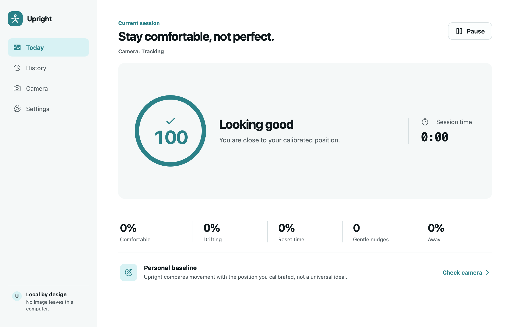
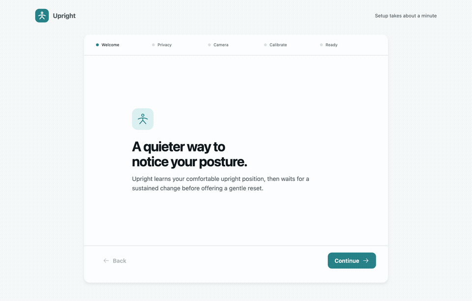
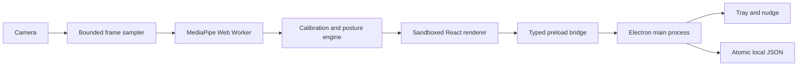

# Upright

Upright is a private desktop companion that notices sustained posture changes with your webcam and offers a gentle reset. Pose estimation happens locally. Frames are processed in memory, then discarded.





> **Beta:** Upright is under active cross-platform validation. See the recorded QA evidence before relying on a specific desktop environment or camera configuration.

## What it does

- Learns a personal upright baseline from a ten-second calibration.
- Scores forward-head movement, head tilt, shoulder slope, compression, and upper-body lean.
- Separates Good, Caution, Poor, Unknown, Away, Paused, and Calibrating states.
- Waits for sustained poor posture and applies a reminder cooldown.
- Keeps aggregate session time without saving frames or landmark history.
- Continues from the macOS menu bar, Windows notification area, or Linux tray.
- Supports system, light, and dark appearance.

Upright is an ergonomic reminder, not a medical device. It does not diagnose, treat, or prevent any condition.

## Privacy model

- No account, cloud service, analytics, or advertising.
- No network request during calibration or tracking.
- The MediaPipe model and WebAssembly runtime are bundled with the app.
- Raw camera frames and landmarks stay inside the sandboxed renderer process.
- Saved files contain only settings, calibration measurements, and aggregate session summaries.
- Export and deletion controls are available in Settings.

## Architecture



The main process never receives images or landmark arrays. It receives a throttled, validated posture snapshot used for tray state, aggregate session accounting, and reminder policy.

## Development

Requirements:

- Node.js 24+
- pnpm 11+
- A webcam for manual tracking tests

```bash
pnpm install
pnpm dev
```

The checked-in pose model is verified before every production build:

```bash
pnpm verify:assets
pnpm build
```

## Quality checks

```bash
pnpm format:check
pnpm lint
pnpm typecheck
pnpm test
pnpm build
pnpm test:e2e
```

The automated suite currently includes 72 unit/component tests and five Electron end-to-end flows. The E2E suite covers deterministic onboarding and calibration, the real bundled MediaPipe worker with Chromium's fake camera, permission recovery, stale-camera fallback, legacy profile continuity, and Upright branding. Physical-camera and clean-installer evidence remains tracked separately rather than being inferred from automation.

Release-readiness checks:

```bash
pnpm test:coverage
pnpm scan:privacy
pnpm audit:prod
pnpm audit:licenses
```

## Packaging

Build a package for the current platform:

```bash
pnpm package
```

Create distributable artifacts:

```bash
pnpm dist:mac
pnpm dist:win
pnpm dist:linux
```

The release workflow builds each operating system on a native GitHub runner. Stable release targets are:

- macOS universal: DMG and ZIP
- Windows x64: NSIS installer and portable ZIP
- Linux x64: AppImage, DEB, RPM, and tar.gz

### Upgrading from Posture 0.5.4 <!-- brand-audit: allow-history -->

Upright deliberately keeps the existing application ID, `posture-desktop` data directory, and Linux package identity. Existing settings, calibrations, sessions, camera permission state, and Chromium data therefore remain available. On macOS, quit Posture before installing Upright, then remove the old `Posture.app` file after confirming the migration; the two filenames can otherwise coexist. <!-- brand-audit: allow-history -->

If a camera does not appear during onboarding, follow the [camera troubleshooting guide](docs/troubleshooting-camera.md). Upright requests video only after the Privacy screen's Continue action and never requests microphone access.

## Compatibility and manual QA

Before a stable release, test:

- Intel and Apple Silicon macOS
- Windows 10 and 11 x64
- Current Ubuntu LTS and Fedora releases
- GNOME and KDE on Wayland and X11 where available
- Integrated and USB cameras
- Permission denied, camera busy, disconnect/reconnect, sleep/wake, multiple displays, and 200% zoom

Compatibility evidence is tracked in [docs/qa/compatibility.md](docs/qa/compatibility.md). Performance methodology is tracked in [docs/qa/performance.md](docs/qa/performance.md). The release process is documented in [docs/release-process.md](docs/release-process.md).

See [CONTRIBUTING.md](CONTRIBUTING.md) for development conventions and [SECURITY.md](SECURITY.md) for private vulnerability reporting guidance.

## License

Upright is available under the [MIT License](LICENSE). Model and dependency notices are listed in [THIRD_PARTY_NOTICES.md](THIRD_PARTY_NOTICES.md).
